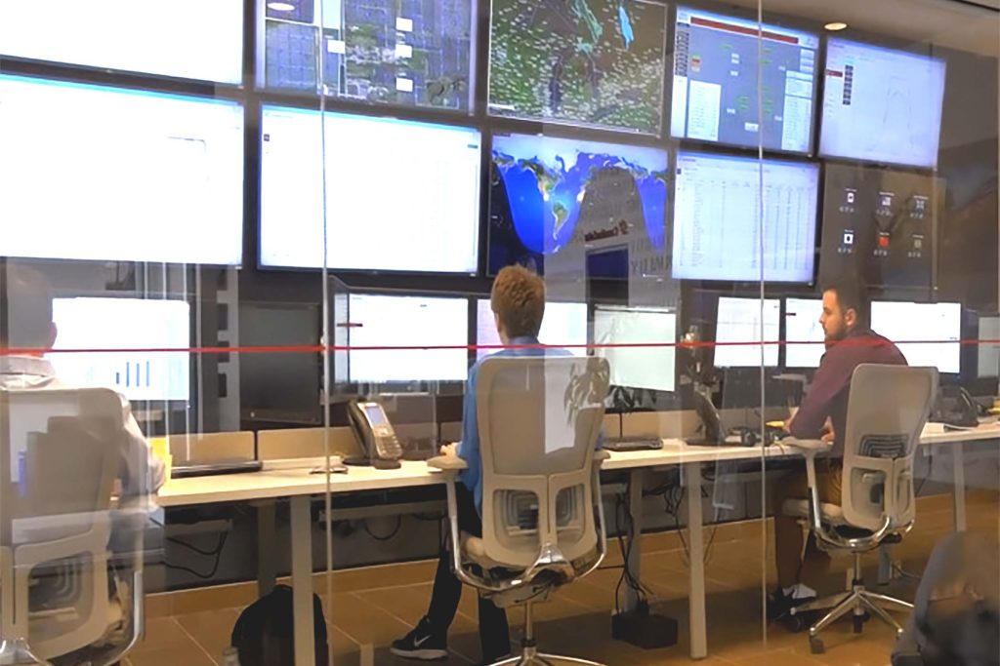

# Work Term 2 Report (S24)

## Abstract/Introduction

This page will show you a peek into my co-op work term, again, at Canadian Solar Inc., also known as Recurrent Energy. I've decided to return here because not only did a recieve a return offer, but because I truly enjoyed working here with amazing peers and supervisors that always push me to my best ability. Returning as a **Full Stack Software Developer** here, I've learnt so many new things that made me grow an even more attraction to this field.

Here, I will share snippets of this experience, showing what I did and the lessons I've learnt here.

## Employer

While Canadian Solar focuses on renewable energy solutions, the development, optimization, and monitoring of solar panels often involve technology and data analysis. Computer science comes into play through the development of software for solar panel efficiency, data analytics for monitoring solar farms, or even AI applications for predictive maintenance.

Canadian Solar (NASDAQ: CSIQ) was founded in 2001 and made its debut on the NASDAQ in 2006. Over the past two decades, Canadian Solar has become a global leader in solar energy and energy storage solutions.

**Fun Facts:**

1. Global Presence: Canadian Solar has subsidiaries in 23 countries and regions on 6 continents.
2. Large Workforce: With over 20,000 employees, the company operates with a substantial team.
3. Production Capacities: CSI Solar anticipates impressive production capacities by December 2024.
4. Project Pipelines: Canadian Solar has a solar project development pipeline of 26.0GWp.
5. Battery Storage: The company is actively involved in battery storage solutions.
6. R&D and Innovation: Canadian Solar has 2,134 authorized patents worldwide.
7. Industry Recognition: The company has received several awards and is rated as a top bankable manufacturer.
8. ESG Commitment: Canadian Solar places importance on Environmental, Social, and Governance (ESG) practices.
9. Vertical Integration: Canadian Solar aims to have greater control over technology, costs, and the supply chain.
10. Community Engagement: It would be interesting to explore if Canadian Solar is involved in community initiatives.

## Goals

**CRITICAL & CREATIVE THINKING - Problem Solving**

Successfully completed a large migration task involving the upgrade of Angular from version 13 to 17, which required extensive problem-solving. Despite not being initially familiar with the task, I navigated complex challenges by researching solutions and applying creative approaches. Regular feedback from colleagues helped refine my solutions. The success of this project is measured by the completion of the migration, resolution of technical issues, and positive feedback received for handling the task independently.

**PROFESSIONAL & ETHICAL BEHAVIOUR - Teamwork**

Focused on improving teamwork and communication skills through active participation in team meetings and collaborative projects. I consistently prepared for meetings by reviewing agendas and providing updates on my tasks. Contributed ideas during discussions and assisted with cross-functional projects, continuously seeking feedback from peers and supervisors. The success of these efforts is evidenced by positive performance reviews, successful project completion, and demonstrated improvements in communication skills within team settings.

**LITERACY - Technological Literacy**

Committed to enhancing my technological literacy in Angular, Python, and HTML/CSS. Dedicated weekly time to learning these technologies through courses and tutorials, while applying best practices to real-world projects. Regular feedback from supervisors and other developers helped me refine my skills. Success is measured through the successful deployment of projects utilizing these technologies, positive feedback on best practices, and noticeable improvements in my proficiency across all three technologies.

## Job Description - FULL STACK SOFTWARE DEVELOPER

**Job Overview:**

As a Software Developer Co-op at Canadian Solar Inc., I contributed to the Operations & Maintenance (O&M) department by developing web applications and data tools for solar plant monitoring and reporting. My focus was on enhancing the performance of the global solar monitoring platform, addressing user feedback, and closing service desk tickets. This experience provided hands-on exposure to both front-end and back-end technologies, supporting the company’s solar energy initiatives.

**Key Achievements:**

Web Development & Data Processing

- Developed and optimized web pages and applications for data reporting and visualization, contributing to improved solar plant monitoring.
- Created custom scripts for data ETL processes, ensuring accurate data warehousing, cleaning, transforming, and modeling.

Global Monitoring Platform Enhancements

- Improved the functionality of Canadian Solar's global monitoring platform by addressing user feedback and resolving service desk tickets.

Ethical Standards & Safety Compliance

- Maintained strict adherence to Canadian Solar’s Code of Business Conduct, ensuring all work was performed to the highest ethical standards while following environmental, health, and safety regulations.

**Skills Utilized:**

Web Development (JavaScript, HTML, CSS)

- Leveraged front-end development skills to create intuitive and functional interfaces for solar plant performance tracking.

Back-End Development (Python, Java)

- Developed back-end tools using Python and Java to support data processing and visualization.

Relational Databases (MySQL, MS-SQL)

- Worked with relational databases for storing and managing data essential to solar plant operations.

Communication & Team Collaboration

- Collaborated closely with team members to design solutions and address issues related to solar data management and reporting.

**Learning Journey:**

Through this co-op, I gained hands-on experience in full-stack web development and data processing tools used in a fast-paced, energy-focused environment. I deepened my understanding of industry best practices and contributed to Canadian Solar's goal of creating a cleaner Earth through solar energy.

## Conclusions

## Acknowledgments