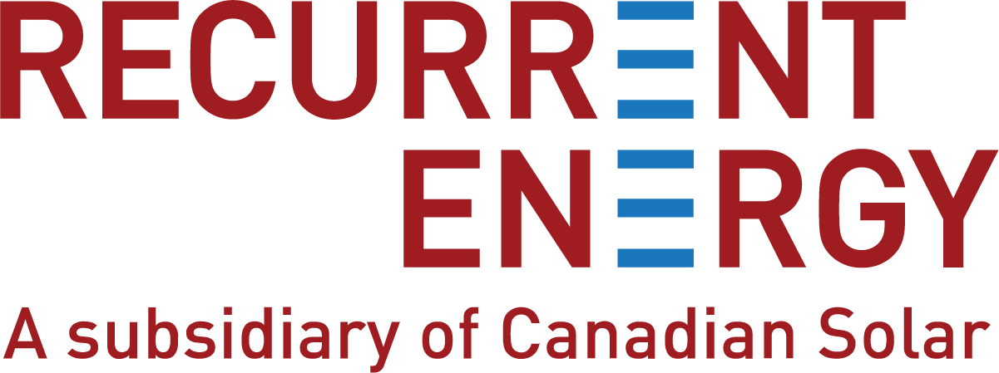
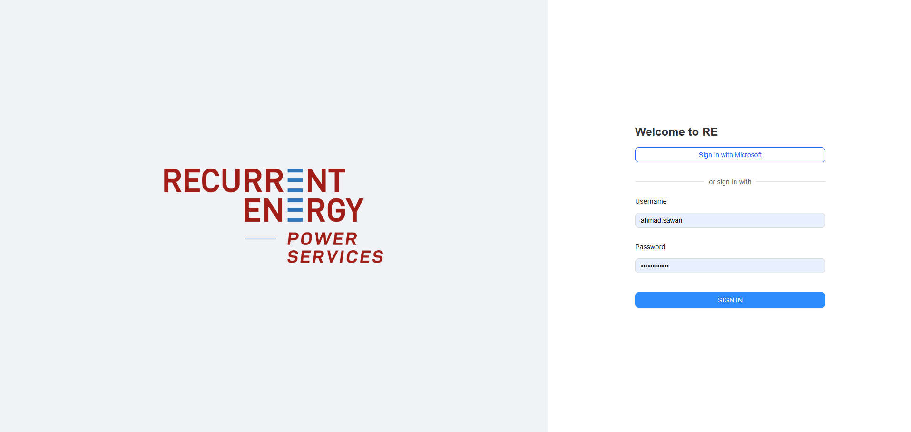

# Work Term 4 Report (F25)

## Abstract/Introduction

This was my **fourth and final co-op work term** at Canadian Solar Inc. (Recurrent Energy), where I continued in the role of **Full Stack Software Developer**. Building on previous terms, I expanded my contributions to the **REview platform**, focusing heavily on improving **problem-solving, technical writing, and teamwork**.  

In this report, I reflect on my responsibilities, the skills I sharpened, and how I measured progress against my learning goals for the term.  

---

## Employer

Canadian Solar (NASDAQ: CSIQ), founded in 2001, is a global leader in solar energy solutions with operations spanning 23 countries. Its Recurrent Energy subsidiary drives utility-scale solar and battery storage projects worldwide.  

The company not only manufactures solar modules but also invests in **digital innovation**, developing platforms like REview to optimize operations, improve contractor engagement, and enhance clean energy project management.  

**Fun Facts:**  
- Holds over 2,100 global patents.  
- Operates a solar project pipeline exceeding 26.0 GWp.  
- Recognized for ESG initiatives and renewable energy leadership.  

---

## Goals

### CRITICAL & CREATIVE THINKING – Problem Solving  

**Action Plan:**  
I worked to improve my ability to resolve complex technical issues by debugging backend Django services and Angular frontend modules. I also tracked recurring bugs and tested multiple solutions before escalating them.  

**Measure of Success:**  
- Solved the majority of assigned issues without external assistance.  
- Reduced average bug turnaround time across sprints.  
- Received positive supervisor feedback on independence in troubleshooting.  

---

### COMMUNICATING – Written Communication  

**Action Plan:**  
My focus was on producing **clear technical documentation** for APIs, authentication flows, and user guides. I drafted Swagger specs, wrote onboarding documentation for contractors, and refined internal Confluence pages for the REview system.  

**Measure of Success:**  
- Documentation required fewer revisions before approval.  
- New contractors were able to follow guides with minimal support.  
- Peers and leads praised the clarity of API documentation.  

---

### PROFESSIONAL & ETHICAL BEHAVIOUR – Teamwork  

**Action Plan:**  
I actively participated in **daily stand-ups, retrospectives, and sprint planning**, while providing constructive feedback in code reviews. I also paired with colleagues to tackle larger issues and learned from their approaches.  

**Measure of Success:**  
- Contributions in pull requests were acknowledged as helpful.  
- Received consistent positive feedback in retrospectives.  
- Successfully collaborated across teams on shared features.  

---

## Job Description – FULL STACK SOFTWARE DEVELOPER  

### Key Contributions this Term  
- Implemented **Two-Factor Authentication (2FA)** for enhanced security.  
- Designed and standardized the **layout for the REview platform** to ensure consistent UI/UX across modules.  
- Integrated **multi-session management** to improve user account handling.  
- Enhanced REview platform reliability by debugging critical backend/frontend issues.  
- Authored detailed technical documentation for APIs and authentication modules.  
- Played a larger role in cross-team collaboration and agile ceremonies.  
- Supported external contractor onboarding with technical guides.  

---

## Conclusion  

This fourth work term marked a refinement of my professional abilities. I not only advanced my technical skills but also grew as a communicator and collaborator. By focusing on **problem-solving, documentation, and teamwork**, I contributed to making the REview platform more reliable, scalable, and user-friendly.  

This experience has reinforced my confidence in tackling challenges independently, documenting work for diverse audiences, and collaborating in a professional software development environment.  

---

## Acknowledgments  

I’d like to thank the incredible team at Canadian Solar once again—especially **Laura Gatto, Kate McRoberts, Anne-Marie Zawadzki, and Nirav Mehta** for believing in my abilities and giving me the space to grow. Their support and mentorship have been foundational to my co-op journey and career development.  
